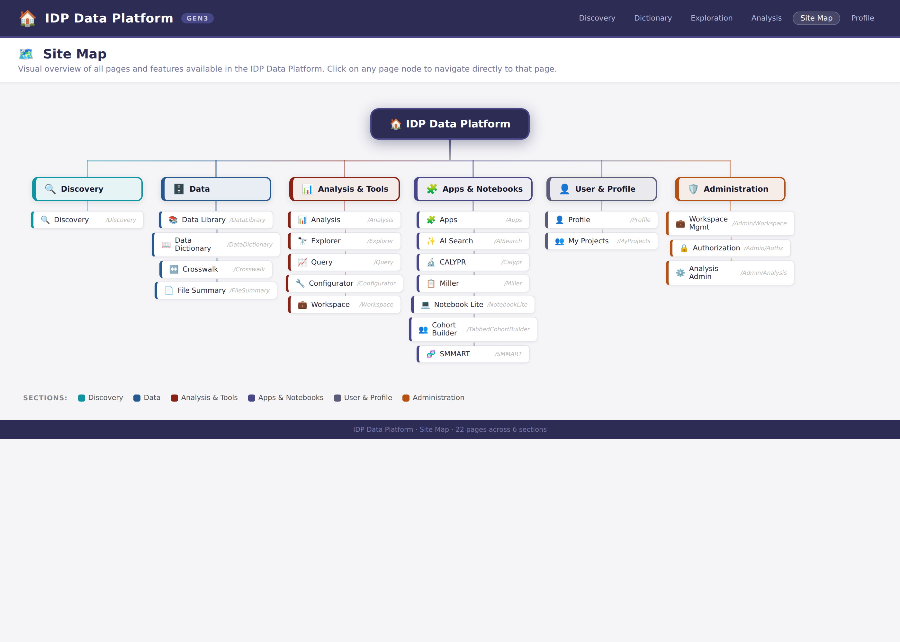

# Site Map

The IDP Data Platform provides an interactive infographic site map that gives a visual overview of all available pages and features. The diagram is accessible at `/SiteMap` once the application is running.

## Overview

The site map page renders a hierarchical, color-coded diagram using [React Flow](https://reactflow.dev/). It is organized into six functional sections, each visually connected to the root platform node.



## Sections

| Section | Accent Color | Pages |
|---------|-------------|-------|
| **Discovery** | Teal `#0d95A1` | Discovery |
| **Data** | Blue `#255990` | Data Library, Data Dictionary, Crosswalk, File Summary |
| **Analysis & Tools** | Crimson `#892115` | Analysis, Explorer, Query, Configurator, Workspace |
| **Apps & Notebooks** | Indigo `#474787` | Apps, AI Search, CALYPR, Miller, Notebook Lite, Cohort Builder, SMMART |
| **User & Profile** | Slate `#5b5b7a` | Profile, My Projects |
| **Administration** | Orange `#b75113` | Workspace Mgmt, Authorization, Analysis Admin |

## Navigation

The site map is reachable from the top navigation bar via the **Site Map** menu item, or by navigating directly to `/SiteMap`.

## Interaction

- **Click** any page node to navigate directly to that page.
- **Scroll / pinch** to zoom in and out.
- **Drag** the canvas to pan around the diagram.
- Use the **Controls** panel (bottom-left) to zoom to fit, zoom in, or zoom out.

## Implementation

The site map is implemented as a Next.js server-side-rendered page in `packages/sampleCommons/src/pages/SiteMap.tsx`. It uses the `@xyflow/react` library (already a project dependency) with three custom node types:

- **`RootNode`** – The platform root node (dark purple).
- **`CategoryNode`** – Section headers with color-coded left-border accents.
- **`PageNode`** – Individual clickable page cards that link to their respective routes.

---

## Updating the Documentation

The screenshot and the standalone HTML template must be kept in sync with `SiteMap.tsx`.  Follow the steps below whenever you add, rename, or remove a section or page.

### Step 1 — Edit the React page

Open `packages/sampleCommons/src/pages/SiteMap.tsx` and modify the `sections` array.

**Adding a new page to an existing section**

```tsx
// Inside the relevant section's `pages` array, append a new entry:
{
  id: 'p-my-new-page',           // unique node id
  label: 'My New Page',          // text displayed on the card
  href: '/MyNewPage',            // Next.js route
  icon: <MdNewIcon size={14} />, // any react-icons/md icon
},
```

**Adding a new section**

```tsx
{
  id: 'my-section',                    // unique section id
  label: 'My Section',                 // section header text
  color: '#1e7a4a',                    // accent hex color
  bgColor: '#e8f4ee',                  // light tint of the accent color
  icon: <MdCategory size={20} />,      // section header icon
  x: 6 * SECTION_GAP,                 // increment the column index
  pages: [
    { id: 'p-foo', label: 'Foo', href: '/Foo', icon: <MdStar size={14} /> },
  ],
},
```

**Removing a page or section** — delete the corresponding entry from `sections`.  React Flow will automatically remove its connecting edges.

### Step 2 — Mirror the change in the HTML template

Open `docs/Overview/sitemap-template.html` and make the same addition/removal in the `SECTIONS` JavaScript array near the bottom of the `<script>` block.  The structure is identical to `SiteMap.tsx` but uses plain strings instead of JSX:

```js
// Add a new page to an existing section:
{ label: 'My New Page', href: '/MyNewPage', icon: '⭐' },

// Add a new section:
{
  id: 'my-section', label: 'My Section',
  color: '#1e7a4a', bgColor: '#e8f4ee', icon: '📂',
  pages: [
    { label: 'Foo', href: '/Foo', icon: '⭐' },
  ],
},
```

### Step 3 — Regenerate the screenshot

Run the provided helper script from the repository root.  The only requirement is that **Chromium** (or Google Chrome) is installed on your system.

```bash
# Default — outputs docs/Overview/images/site-map.png at 2800×2000 px (2× Retina)
./scripts/generate-sitemap-screenshot.sh
```

The script prints progress and a final verification line:

```
Using browser: /usr/bin/chromium  (Chromium 145.x …)
Rendering 1400×1000 @ 2× DPR → 2800×2000 px PNG
Screenshot saved: docs/Overview/images/site-map.png
✅  Verified: 2800×2000 px  (294 KB)
```

**Optional environment variables** let you customize the output without editing the script:

| Variable | Default | Description |
|----------|---------|-------------|
| `SITE_MAP_TEMPLATE` | `docs/Overview/sitemap-template.html` | Path to the HTML template |
| `SITE_MAP_OUTPUT` | `docs/Overview/images/site-map.png` | Output PNG path |
| `SITE_MAP_WIDTH` | `1400` | Viewport width in CSS px |
| `SITE_MAP_HEIGHT` | `1000` | Viewport height in CSS px |
| `SITE_MAP_DPR` | `2` | Device pixel ratio (2 = Retina quality) |

```bash
# Example: wider viewport, lower DPR
SITE_MAP_WIDTH=1600 SITE_MAP_DPR=1 ./scripts/generate-sitemap-screenshot.sh
```

### Step 4 — Commit both files

```bash
git add packages/sampleCommons/src/pages/SiteMap.tsx \
        docs/Overview/sitemap-template.html \
        docs/Overview/images/site-map.png
git commit -m "docs: update site map — add <description of change>"
```
